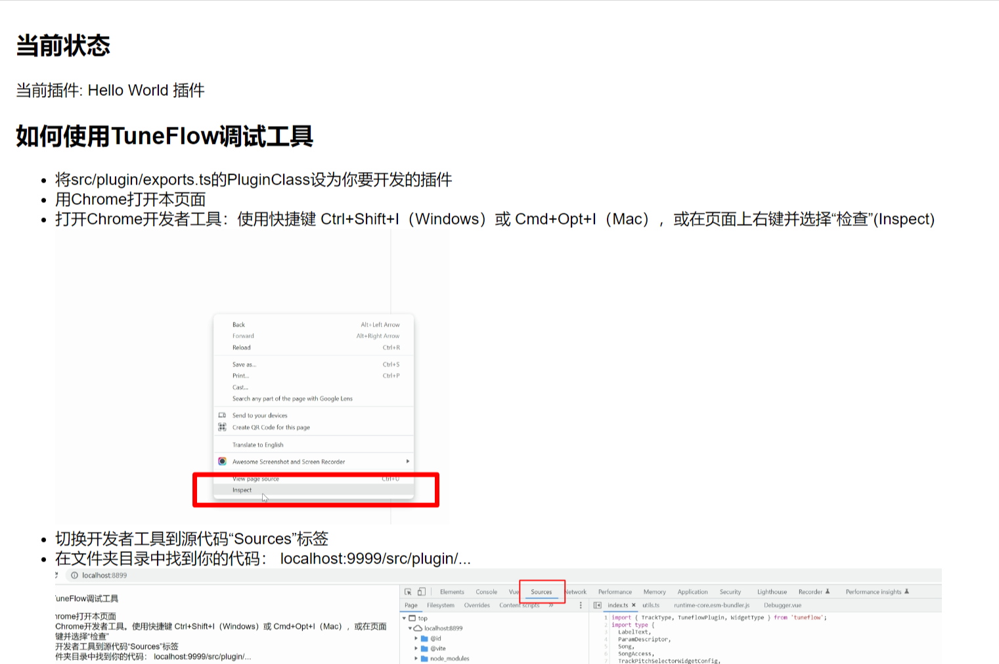
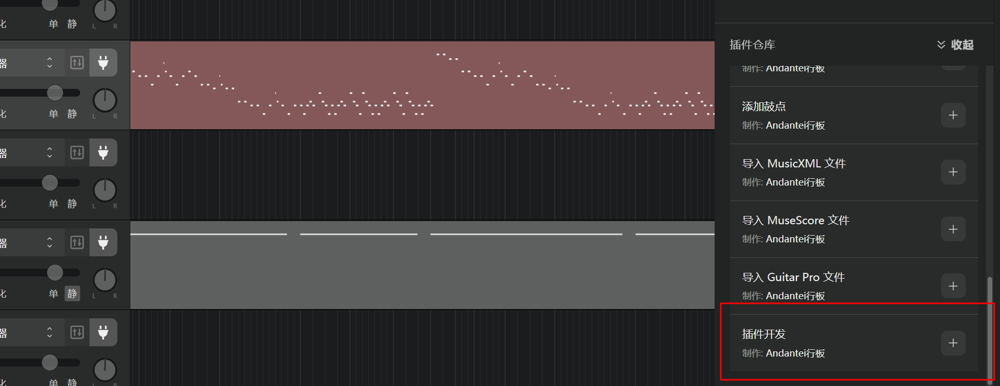
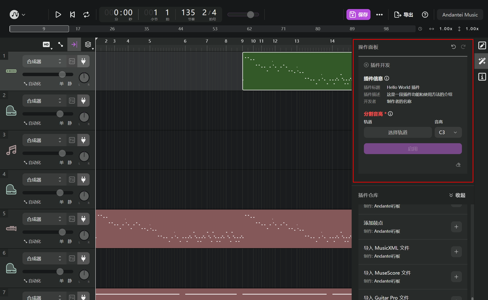
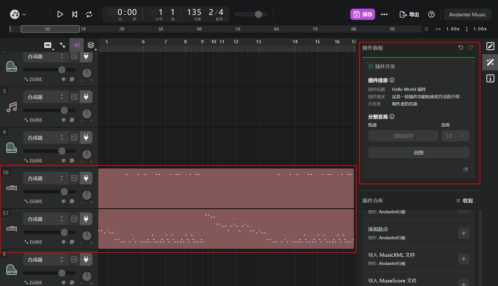
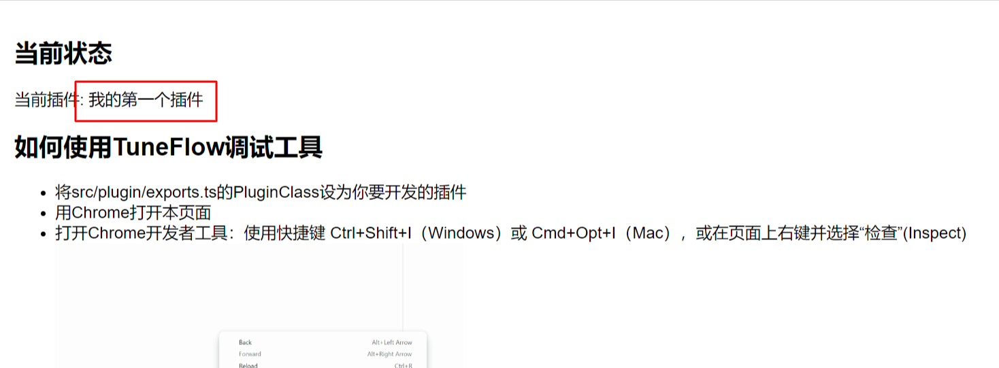
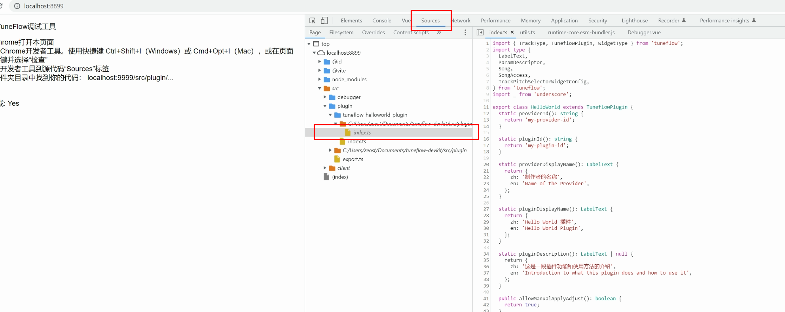
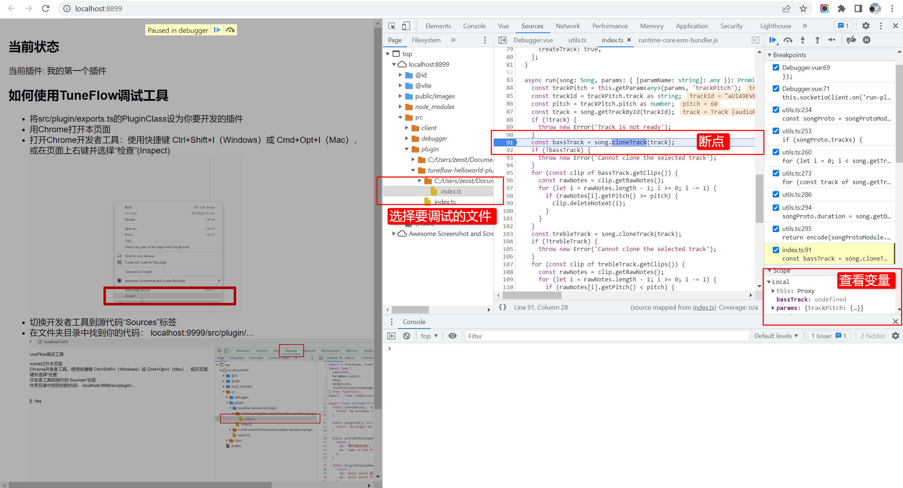

# TuneFlow DevKit

这里是 TuneFlow DevKit -- TuneFlow 插件开发工具。

TuneFlow DevKit 允许你在 TuneFlow 桌面版中运行你开发中的 TuneFlow 插件，并通过一个运行在本地的 Debug 服务器进行调试。

## 准备工作

### 安装 NodeJS

首先需要确保你已经安装了**nodejs>=16**。在命令行运行以下指令查看 安装 NodeJS 的版本：

```bash
node -v
```

如果运行报错，或者版本低于 16，意味着我们需要手动安装最新版本的 nodejs，在[这里](https://nodejs.org/zh-cn/download/)查看 NodeJS 的官方说明文档。

### 克隆 tuneflow-devkit

将 TuneFlow DevKit 克隆到本地：

```bash
git clone --recurse-submodules https://github.com/andantei/tuneflow-devkit.git
```

注意这里我们必须加上`--recurse-submodules`，这样可以确保 tuneflow-devkit 下面的子代码库也被克隆到了本地。

### 安装 nodejs 依赖

在 tuneflow-devkit 目录下运行以下命令安装项目需要的 nodejs 依赖库：

```bash
npm install
```

## 运行示例插件

我们先用 tuneflow-devkit 自带的 tuneflow-helloworld-plugin 来演示如何用 DevKit 与 TuneFlow 桌面版进行联调。

### 运行 DevKit 本地调试工具

在 tuneflow-devkit 目录中运行以下命令：

```bash
npm run dev
```

如果你的 nodejs 和 node_modules 安装正确，你将会看到类似以下输出：

```bash
$ npm run dev

> tuneflow-devkit@1.0.0 dev
> npm run build-protos && npm run start-debugger


> tuneflow-devkit@1.0.0 build-protos
> node scripts/build_protos.js


> tuneflow-devkit@1.0.0 start-debugger
> concurrently --kill-others "vite --config vite.dev.config.ts" "node src/debugger/dev_proxy.js"

[1] starting dev proxy server on port 18818
[1] new daw connection
[0]
[0]   VITE v3.2.4  ready in 855 ms
[0]
[0]   ➜  Local:   http://localhost:8899/
[0]   ➜  Network: http://192.168.68.71:8899/
[0]   ➜  Network: http://172.30.192.1:8899/
```

其中[http://localhost:8899](http://localhost:8899)就是我们的调试工具地址。

接下来我们在浏览器中打开它。



可以看到 Hello World 插件已经被加载到了调试代码中。

### 在 TuneFlow 桌面版中运行示例插件

接下来打开 TuneFlow 桌面版，创建或打开一首你的曲子，并运行“插件开发”插件。



“插件开发”插件将会自动与 DevKit 建立连接，将我们在开发的插件添加到操作面板中。如图所示：



我们的示例插件 tuneflow-helloworld-plugin 的功能是将 MIDI 轨道划分为高低两个声部。填写好参数后选择启用插件，我们可以看到选择的轨道被成功分成了两个声部。



## 开发你的第一个插件

接下来我们可以开始开发自己的插件。

### 配置代码库

为了方便管理代码，我们需要首先给自己的插件建立一个 git 代码库，然后通过子模块的方式加入进 tuneflow-devkit 中。你可以从头新建一个 git repo，也可以 fork TuneFlow 提供的 Hello World 示例 [https://github.com/andantei/tuneflow-devkit.git](https://github.com/andantei/tuneflow-devkit.git)。

建立好你的 git repo 后，在 tuneflow-devkit repo 的根目录下运行以下指令将其克隆至开发目录：

```bash
# 在tuneflow-devkit文件夹下运行以下指令
# 将repo地址换成你的插件代码库地址(以.git结尾)

git submodule add <your_repo@somegitwebsite.com.git> src/plugin/
```

完成后，tuneflow-devkit 的目录结构应该变成这样：

```
-- ...
-- src
    -- debugger
        -- ...
    -- plugin
        -- exports.ts
        -- tuneflow-helloworld-plugin
        -- <your_repo>
            -- ...
-- ...
```

至我们就完成了代码库的配置。

### 激活待开发的插件

接下来我们将`src/plugin/export.ts`中的 PluginClass 指向我们自己的插件。将以下代码：

```typescript
import { HelloWorld } from './tuneflow-helloworld-plugin';
const PluginClass = HelloWorld;
export default PluginClass;
```

修改为：

```typescript
import { YourPlugin } from './your_repo';
const PluginClass = YourPlugin;
export default PluginClass;
```

### 运行 DevKit

接下来运行 DevKit，切换到 tuneflow-devkit 目录，运行以下指令：

```bash
npm run dev
```

如前面所述，当所有配置正确时，我们应该在界面中看到正在开发的插件已经切换到了我们自定义的插件。



按照前面描述的步骤启动 TuneFlow 桌面版后，我们便可以通过“插件开发”插件运行我们的自定义插件。

### 调试代码

调试较大的项目时，我们往往需要设置断点，查看代码的运行流程和变量的取值。在 DevKit 中，我们可以借助浏览器自带的开发工具来完成。

首先用 Chrome 打开运行`npm run dev`后输出的网址，通常是`http://localhost:8899`。确保 TuneFlow 桌面版也同时打开，并加载了测试用的曲目。

随后打开 Chrome 开发者工具：使用快捷键 `Ctrl+Shift+I（Windows）`或 `Command+Option+I（macOS）`，或在页面上右键并选择“检查”(Inspect)。

在开发工具中切换到源代码(Sources)标签页。



在文件树中找到你需要调试的代码文件，通常是`src/plugin/<your_repo>/<your_plugin_file>.ts`，点击需要调试的代码左侧的行号即可设置断点。

设置好断点后，切换到 TuneFlow 桌面版，运行“插件开发”插件，这时再切换回 DevKit，我们的代码就进入了断点。


